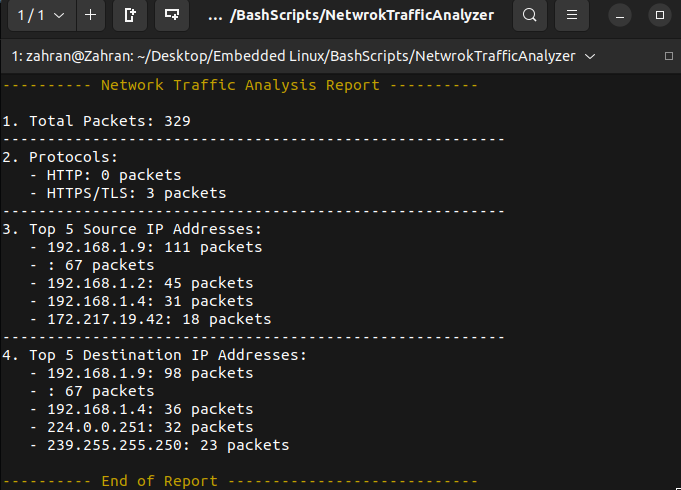

# Network Traffic Analyzer Script

This Bash script analyzes network traffic from a specified Wireshark pcap file. It provides insights into the total number of packets, the types of protocols used, and the top source and destination IP addresses involved in the traffic.

## Features

- Counts total packets in the pcap file.
- Identifies the number of HTTP and HTTPS/TLS packets.
- Lists the top 5 source IP addresses with their corresponding packet counts.
- Lists the top 5 destination IP addresses with their corresponding packet counts.

## Requirements

- **tshark**: The script uses `tshark`, which is part of the Wireshark suite. Make sure it is installed on your system. You can install it using the following command on Ubuntu:

  ```bash
  sudo apt-get install tshark
  ```

## Usage

1. Clone this repository or download the script.
2. Open a terminal and navigate to the directory where the script is located.
3. Make the script executable (if it's not already):

   ```bash
   chmod +x analyze_traffic.sh
   ```

4. Run the script:

   ```bash
   ./analyze_traffic.sh
   ```

5. When prompted, enter the path to your `.pcap` file.

## Example

```bash
Enter File Path:
/path/to/your/file.pcap
```

## Output:

